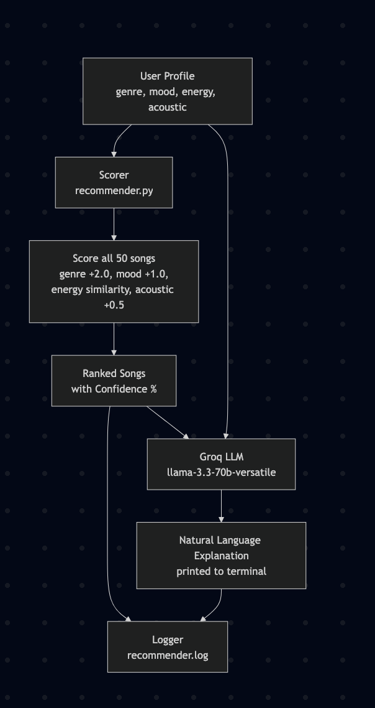

# 🎵 Applying AI to Music Recommendations

## Base Project

This project extends [VibeSmash](https://github.com/abdel-csc/ai110-module3show-musicrecommendersimulation-starter), a content-based music recommender built in Module 3. The original system scored songs against a user's taste profile using genre, mood, and energy attributes, then returned the top 5 matches with a score breakdown. It had 10 songs and no LLM integration.

---

## What This Version Adds

- **LLM Integration via RAG:** The top 5 scored songs plus the user profile are passed to Groq's llama-3.3-70b-versatile model, which generates a natural language explanation of why those songs fit the listener. The scoring system acts as the retriever and the LLM acts as the generator, which is the RAG pattern.
- **Confidence Scoring:** Each song's raw score is normalized to a percentage (score / 4.5) and displayed alongside the recommendation.
- **Logging:** Every profile run is written to `recommender.log` using Python's logging module, recording the profile name, top song, and score.
- **Expanded Dataset:** The catalog was expanded from 10 to 50 songs across 7 genres to reduce imbalance and make retrieval more meaningful.

---

## System Architecture



---

## How the Scoring Works

Each song is scored against the user profile using this formula:

- Genre match: +2.0 points
- Mood match: +1.0 point
- Energy closeness: `1 - abs(song_energy - target_energy)` (between 0.0 and 1.0)
- Acoustic preference match: +0.5 points (if applicable)

Maximum possible score: 4.5. Confidence % = score / 4.5.

---

## Setup

1. Clone the repo:

```bash
git clone https://github.com/abdel-csc/ApplyingAItoMusicRecs.git
cd ApplyingAItoMusicRecs
```

2. Install dependencies:

```bash
pip install -r requirements.txt
```

3. Create a `.env` file with your Groq API key:
"GROQ_API_KEY=your_key_here" Why GROQ? I go more deeper as to why in the model card but essentially its similar to Gemini with a lot less restrictions. 
4. Run:

```bash
python -m src.main
```

---

## Sample Interactions

### High-Energy Pop Profile
```
==================================================
Profile: High-Energy Pop
Confetti Rain - Score: 4.00 | Confidence: 89%
Because: genre match (+2.0), mood match (+1.0), energy similarity (+1.00)
Heartbeat Pop - Score: 3.99 | Confidence: 89%
Because: genre match (+2.0), mood match (+1.0), energy similarity (+0.99)
City Lights - Score: 3.99 | Confidence: 89%
Because: genre match (+2.0), mood match (+1.0), energy similarity (+0.99)
AI says:
These songs are an excellent match. All five are pop tracks with a happy
mood and energy levels clustered tightly around 0.80, matching the user's
target almost exactly. Genre and mood both align, resulting in near-perfect scores.
```

### Chill Lofi Profile
```
==================================================
Profile: Chill Lofi
Library Rain - Score: 4.00 | Confidence: 89%
Because: genre match (+2.0), mood match (+1.0), energy similarity (+1.00)
Foggy Morning - Score: 3.99 | Confidence: 89%
Because: genre match (+2.0), mood match (+1.0), energy similarity (+0.99)
AI says:
These lofi tracks are a strong match. Their low energy levels closely mirror
the target of 0.35, and all carry a chill mood that aligns with the listener's
preference for relaxed, background-style music.
```
### Conflicting Profile (sad + high energy)
```
==================================================
Profile: Conflicting (sad + high energy)
Power Surge - Score: 3.00 | Confidence: 67%
Because: genre match (+2.0), energy similarity (+1.00)
AI says:
These songs match on genre and energy but not on mood. The listener prefers
sad music, but no pop songs in the catalog carry that mood, so the system
defaulted to energy as the tiebreaker. This is a dataset gap, not a scoring error.
```
---

## Design Decisions

- **Groq over Gemini:** Gemini's free tier was exhausted across all available Google accounts. Groq provided a working free tier with comparable output quality and lower latency.
- **RAG pattern:** The scoring system serves as the retriever, selecting the most relevant songs, and the LLM generates explanations grounded in that retrieved context. This is the same pattern as DocuBot from Module 4, applied to structured song data instead of documents.
- **Confidence cap at 4.5:** The maximum possible score is 4.5. Using this as the denominator gives a meaningful upper bound that reflects how well a song can actually match a profile.
- **50-song dataset:** The original 10-song catalog severely underrepresented most genres. Expanding to 50 songs across 7 genres made retrieval more competitive and LLM explanations more meaningful.

---

## Testing Summary

5 automated tests in `tests/test_recommender.py`:
tests/test_recommender.py::test_recommend_returns_songs_sorted_by_score PASSED
tests/test_recommender.py::test_explain_recommendation_returns_non_empty_string PASSED
tests/test_recommender.py::test_genre_match_boosts_score PASSED
tests/test_recommender.py::test_recommend_respects_k PASSED
tests/test_recommender.py::test_acoustic_preference_boosts_acoustic_song PASSED
5 passed in 0.02s. Hooray!

All 5 pass. Tests cover score sorting, explanation output, genre boost behavior, k-limit enforcement, and acoustic preference scoring.

---

## Reflection

The most useful moment in this project was the conflicting profile, a user who wanted sad mood but high energy pop. The scoring system returned songs that matched genre and energy but completely missed the mood. What made it interesting was that the LLM then correctly identified this in its explanation, calling out the mood mismatch rather than pretending the results were a good fit. That kind of honest output from the model was more useful than a blindly positive explanation would have been.

The main technical friction was the Gemini quota wall. The free tier was fully exhausted across multiple Google accounts, which forced a mid-build switch to Groq. That turned out to be the better outcome since Groq's latency is lower and the API is more predictable for this use case.

The bigger lesson: genre's +2.0 weight dominates the scoring in almost every case. In a real production system, that kind of feature weighting shapes what millions of users see and never see. The conflicting profile showed that clearly since the system gave confident-looking results that were genuinely a bad match because genre won every time.

---

## The Verdict

A project like this shows that as a creator, you're never really quite done with what you make. Especially in the new growing world of AI. Old projects such as these can be modified for optimization.
